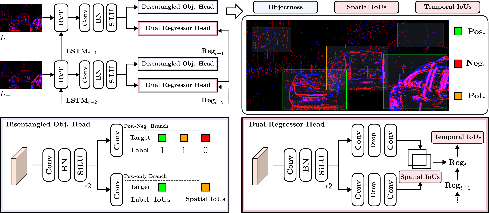

# Detecting Every Object from Events
## Framework


## Comparasion with the RVT in close-set setting (training with pedestrians and cars)


## Installation
We recommend using cuda11.8 to avoid unnecessary environment problem.
```
conda create -y -n deoe python=3.11
conda activate deoe

pip install torch==2.1.1 torchvision==0.16.1 torchaudio==2.1.1

pip install pytorch_lightning==1.8.6 wandb pandas plotly opencv-python tabulate pycocotools
bbox-visualizer StrEnum hydra-core einops torchdata tqdm numba h5py hdf5plugin lovely-tensors
tensorboardX pykeops scikit-learn ipdb timm
```

## Required Data
### DSEC
You could download the processed DSEC-Detection by click here.

### GEN4
You could get the raw GEN4 in [RVT](https://github.com/uzh-rpg/RVT).
And get the processed data by following the [Instruction](https://github.com/uzh-rpg/RVT/blob/master/scripts/genx/README.md) proposed by RVT.
Note that to keep the labels for all the classes following [here](https://github.com/uzh-rpg/RVT/issues/4).

## Checkpoints
<table>
  <tr>
    <th style="text-align:center;"> </th>
    <th style="text-align:center;">DSEC-Detection</th>
    <th style="text-align:center;">GEN4</th>
  </tr>
  <tr>
    <td style="text-align:center;">Pre-trained checkpoints</td>
    <td style="text-align:center;"><a href="https://1drv.ms/u/c/93289205239bc375/EQue4dcG4M9Ggbu5dM-iOc0B1vGjEw8oGxSUFdPjUDgtnw?e=CaeBbl">download</a></td>
    <td style="text-align:center;"><a href="https://1drv.ms/u/c/93289205239bc375/EQue4dcG4M9Ggbu5dM-iOc0B1vGjEw8oGxSUFdPjUDgtnw?e=CaeBbl">download</a></td>
  </tr>
  <tr>
    <td style="text-align:center;">AUC-Unknown</td>
    <td style="text-align:center;">25.1</td>
    <td style="text-align:center;">23.3</td>
  </tr>
</table>

## Evaluation
Set `DATASET` = `dsec` or `gen4`.

Set `DATADIR` = path to either the DSEC-Detection or 1 Mpx dataset directory.

Set `CHECKPOINT` = path to the checkpoint using for evaluation.

```Bash
python validation.py dataset={DATASET} dataset.path={DATADIR} checkpoint={CHECKPOINT} +experiment/{DATASET}='base.yaml'
```
The batchsize, lr, and the other hyperparameters could be adjusted in file `config\experiments\dataset\base.yaml`.

### Evaluation for mixed categories or each category.
Set the `testing_classes` to full categories in file `config\dataset\dataset.yaml`.

Set the `unseen_classes` to the categories evaluated as the unknown categories in file `config\dataset\dataset.yaml`.

The first results outputed by console is the results for unseen_classes, while the second is for testing_classes (generally full categories).

### Computed AUC for recall curve.
```Bash
python compute_auc.py
```
## Training
Set `DATASET` = `dsec` or `gen4`.

Set `DATADIR` = path to either the DSEC-Detection or 1 Mpx dataset directory.

```Bash
python train.py dataset={DATASET} dataset.path={DATADIR} +experiment/{DATASET}='base.yaml'
```
The batchsize, lr, and the other hyperparameters could be adjusted in file `config\experiments\dataset\base.yaml`.

## Visualization of results 
Set `DATASET` = `dsec` or `gen4`.

Set `CHECKPOINT` = path to the checkpoint using for evaluation.

Set `h5_file` = path to files used to visualization like `h5_file = /DSEC_process/val/zurich_city_15_a`.

```Bash
python demo.py dataset={DATASET} checkpoint={CHECKPOINT} +experiment/{DATASET}='base.yaml'
```
Then the output images and video will be saved in  folder `DEOE\prediction`.

## Cition
If you find our work is helpful, please considering cite us as:
```bibtex
@article{zhang2024detecting,
  title={Detecting Every Object from Events},
  author={Zhang, Haitian and Xu, Chang and Wang, Xinya and Liu, Bingde and Hua, Guang and Yu, Lei and Yang, Wen},
  journal={arXiv preprint arXiv:2404.05285},
  year={2024}
}
```


